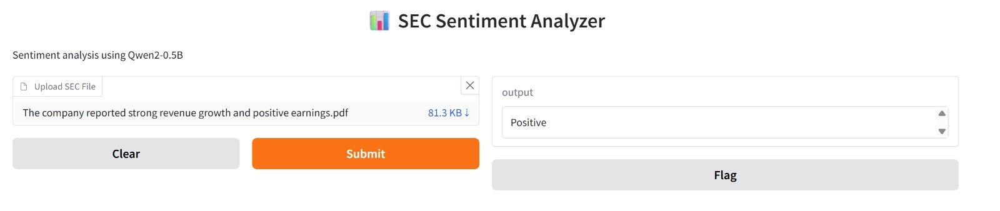

# SEC Sentiment Analyzer

This project uses Qwen2-0.5B to analyze the sentiment of SEC files.

## Features

- Upload SEC files (.txt or .pdf)
- Analyze sentiment
- Uses Qwen2-0.5B
- Built with Gradio

## Technologies

- Python
- Transformers
- Gradio
- Qwen2-0.5B

## App Screenshot

